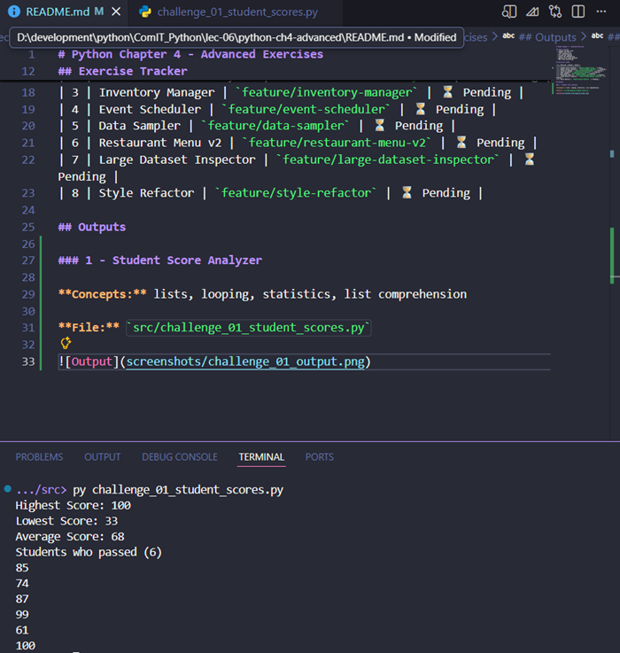

# Python Chapter 4 - Advanced Exercises

## Topics Covered
 - Looping through lists
 - range() and list()
 - List comprehensions
 - Slicing and copying
 - Tuples and immutability
 - Working with large datasets
 - PEP 8 and refactoring

## Exercise Tracker

| # | Exercise | Branch | Status |
|---|----------|--------|--------|
| 1 | Student Score Analyzer | `feature/student-scores` | ✅ Done |
| 2 | Number Pattern Analyzer | `feature/number-analyzer` | ⏳ Pending |
| 3 | Inventory Manager | `feature/inventory-manager` | ⏳ Pending |
| 4 | Event Scheduler | `feature/event-scheduler` | ⏳ Pending |
| 5 | Data Sampler | `feature/data-sampler` | ⏳ Pending |
| 6 | Restaurant Menu v2 | `feature/restaurant-menu-v2` | ⏳ Pending |
| 7 | Large Dataset Inspector | `feature/large-dataset-inspector` | ⏳ Pending |
| 8 | Style Refactor | `feature/style-refactor` | ⏳ Pending |

## Outputs

### 1 - Student Score Analyzer

**Concepts:** lists, looping, statistics, list comprehension

**File:** `src/challenge_01_student_scores.py`

